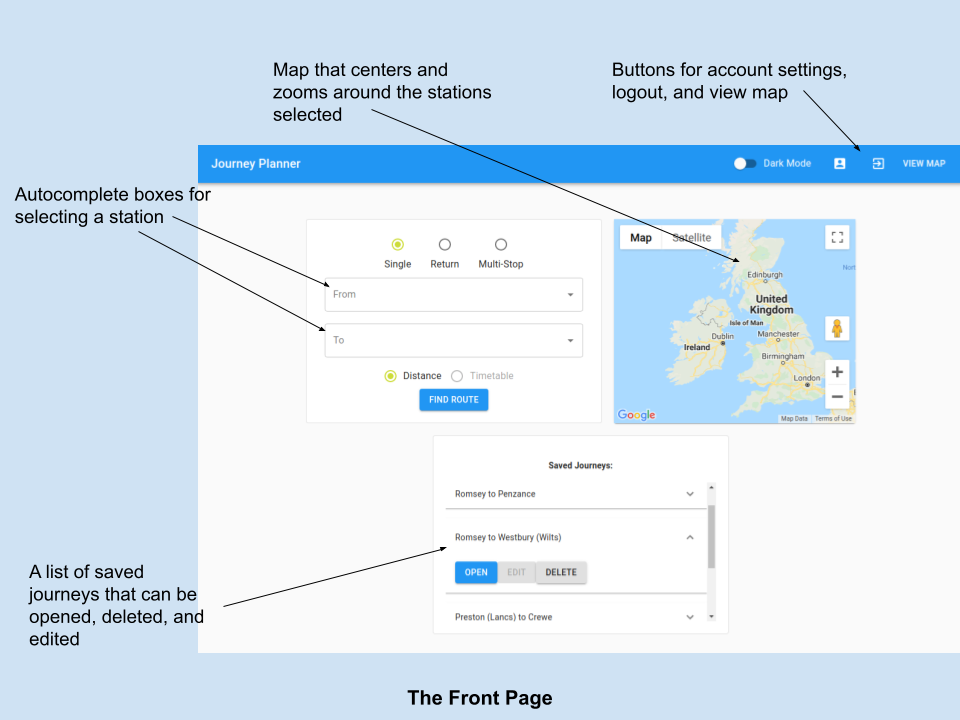
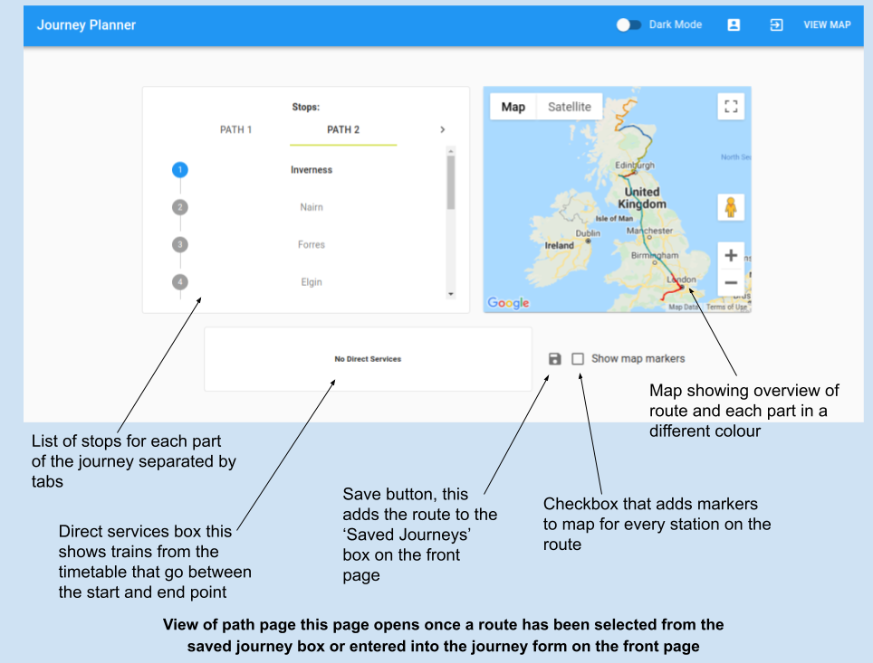
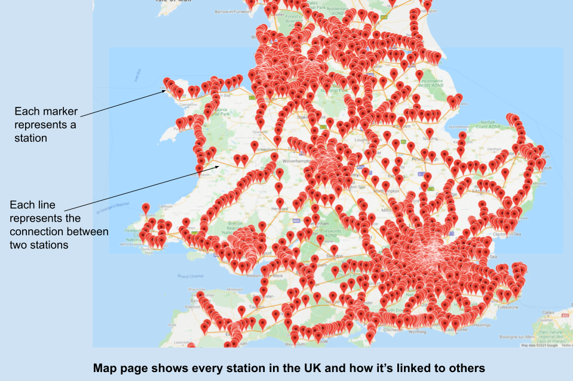

# Journey Planner
For my A-Level Computer Science coursework, I decided to write a journey planner that can be used for planning routes across the UK
rail network. Using a database containing geographical locations of all stations and how each station is linked to others, a path can
be calculated between any two stations. This uses a path finding algorithm based on the A* search algorithm.

The projected was designed in the form of a website using ReactJS for the frontend and C# ASP.NET was used on the backend to create a REST API to
communicate with the frontend app.

[Check out a demo of the project here](https://planner.wkaye.dev/)

## Completed Objectives
- Store basic information for every station in the UK
- Autocomplete on the form when selecting a station
- Use a pathfinding algorithm to find the best route to get between the stations. 
- Return the details of the route, including all stations the route would pass through.
- Save the route for the user to go back to later
- Work on a mobile and desktop device 
- Display data to help the user on their journey such as which platform the train arrives on 
- Render a graph for the whole uk rail network over a map
- Draw the generated path on a map
- Be able to create a account
- Login to an account
- Change account details
- Dark Mode
- Ability to plan a route with multiple stops

## Screenshots




## File Structure
````
.
├── JourneyPlanner
│   ├── ClientApp - The front end web app
│   │   ├── package-lock.json
│   │   ├── package.json - List of dependencies
│   │   ├── public
│   │   │   └── index.html - First file to load in the browser and the root div is populated by index.js
│   │   └── src
│   │       ├── App.js - Main Component
│   │       ├── PrivateRoute.js
│   │       ├── checkLogin.js
│   │       ├── components
│   │       │   ├── JourneyForm
│   │       │   │   ├── AlgorithmType.js - Radio buttons for distance or service based route
│   │       │   │   ├── MultiStop.js - Multi-Stop options
│   │       │   │   ├── Return.js - Two way journey options
│   │       │   │   ├── Single.js - One way options
│   │       │   │   ├── Stop.js - Autocomplete box
│   │       │   │   ├── ToFrom.js - To/From input boxes
│   │       │   │   ├── Type.js - Ratio buttons for Return, Single, Multi-Stop options
│   │       │   │   └── search.js - Searches for stations based on input 
│   │       │   ├── JourneyForm.js - Form for entering journey details
│   │       │   ├── JourneyForm.module.css
│   │       │   ├── MapViewer.js - Google Maps component
│   │       │   ├── MapViewer.module.css
│   │       │   ├── MapViewer2.js - Google Maps component for path view
│   │       │   ├── Nav.js - Navigation bar at top of page
│   │       │   ├── Nav.module.css
│   │       │   ├── PageContainer.js - Adds grid system
│   │       │   ├── PageContainer.module.css
│   │       │   ├── SavedJourneys.js - Lists saved journeys
│   │       │   ├── Tile.js - Creates a border
│   │       │   ├── Tile.module.css
│   │       │   ├── account
│   │       │   │   ├── ChangePassword.js
│   │       │   │   └── DeleteAccount.js
│   │       │   └── routes
│   │       │       ├── DirectServices.js - Details of direct services e.g. platform number
│   │       │       ├── RoutesBox.js - List of stops for a route
│   │       │       └── RoutesBox.module.css
│   │       ├── index.css
│   │       ├── index.js - Main entry point
│   │       ├── pages
│   │       │   ├── Account.js - Account settings
│   │       │   ├── Account.module.css
│   │       │   ├── Editor.js - For linking stations together
│   │       │   ├── Front.js - Displays journey form and saved journeys
│   │       │   ├── Login.js
│   │       │   ├── Map.js - Map viewer to view the whole network on a map
│   │       │   ├── NewUser.js
│   │       │   └── PathView.js - Path and Journey details page
│   │       ├── reducers
│   │       │   ├── route.js - Journey state
│   │       │   └── user.js - User data
│   │       └── store.js - Setup redux store and reducers
│   ├── Controllers
│   │   ├── LoginController.cs - API controller for logging in and account creation
│   │   ├── StationsController.cs - API controller for sending station data
│   │   └── UserController.cs - API controller for user information
│   ├── Dockerfile - Commands for setting up container
│   ├── JourneyPlanner.csproj
│   ├── JourneyPlanner.csproj.user
│   ├── Models
│   │   ├── BasicService.cs
│   │   ├── Line.cs
│   │   ├── LoginInput.cs
│   │   ├── Node.cs
│   │   ├── Path.cs
│   │   ├── RTT
│   │   │   ├── RttService.cs
│   │   │   └── RttServiceList.cs
│   │   ├── Service.cs
│   │   ├── Station.cs
│   │   ├── Stop.cs
│   │   ├── TransportAPI.cs
│   │   └── User
│   │       ├── CreateUser.cs
│   │       ├── User.cs
│   │       └── UserRoute.cs
│   ├── Program.cs
│   ├── Properties
│   │   └── launchSettings.json
│   ├── Services
│   │   ├── DatabaseService.cs - Communicates with the SQL server
│   │   ├── IPasswordService.cs
│   │   ├── IRealtimeService.cs
│   │   ├── IStationService.cs
│   │   ├── ITimetableService.cs
│   │   ├── PasswordService.cs - Encrypts and verifies passwords
│   │   ├── RealtimeService.cs - Communicates with realtime trains
│   │   ├── StationService.cs - Handles station data e.g. get a particular station
│   │   └── TimetableService.cs - Handles service data 
│   ├── Startup.cs - Configures services and server details
│   ├── appsettings.Development.json
│   ├── appsettings.json - Contains settings for connections such as SQL and RTT
├── JourneyPlanner.sln
└── README.md
````

